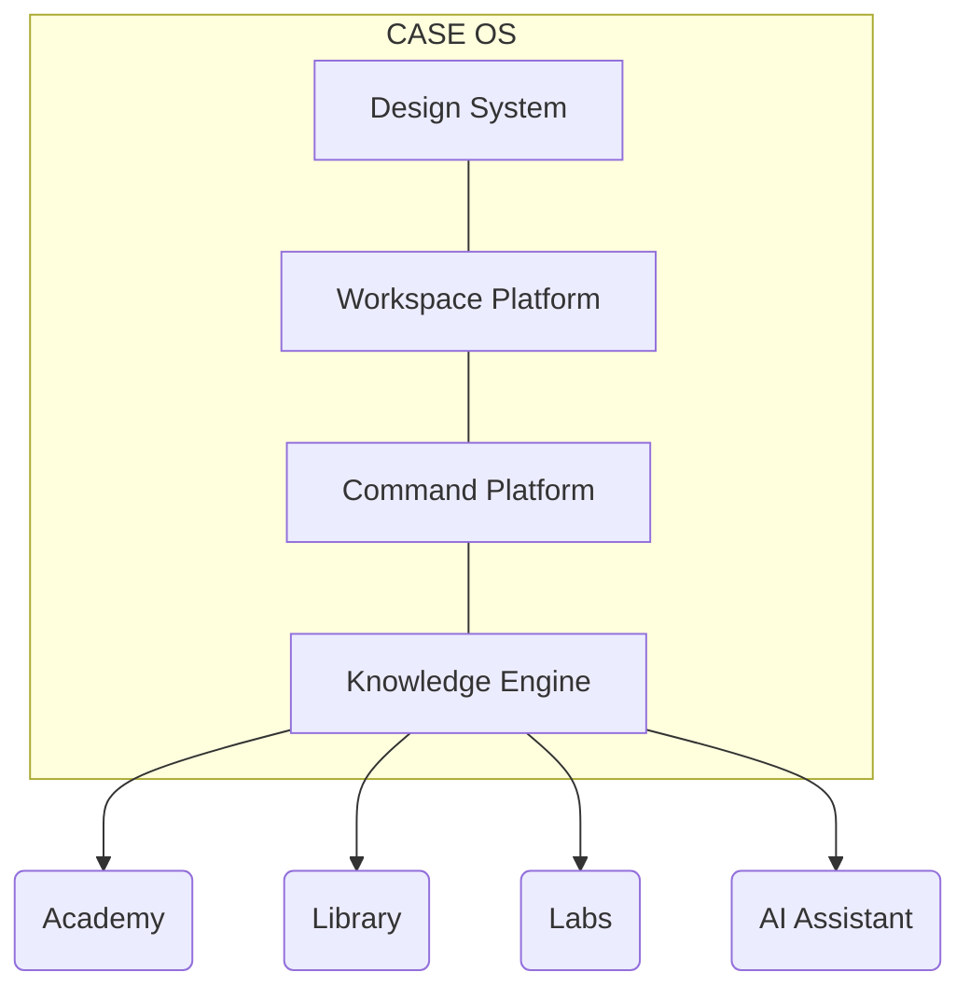

# CASE OS Architecture

Este documento describe la arquitectura central de **CASE OS**, la plataforma de ingeniería subyacente que impulsa CASE. 

CASE ha evolucionado de ser una plataforma tradicional de cursos (LMS) a convertirse en un **Engineering Workspace** inmersivo, inspirado en herramientas profesionales como VS Code, Linear y Raycast. Esta arquitectura garantiza que la aplicación sea escalable, predecible y extensible a través del tiempo.

---

## El Paradigma OS

En lugar de construir "páginas" aisladas, CASE se construye como un sistema operativo basado en **Motores (Engines)** y **Manifiestos Declarativos**. 

La Interfaz de Usuario (UI) es puramente un reflejo del estado de estos motores y nunca contiene lógica de negocio o reglas de enrutamiento acopladas.

---

## Los 4 Pilares de la Plataforma

### 1. Design Engine (CASE Design System)
La única fuente de verdad para la capa visual.
* **Prohibido el uso de utilidades hardcodeadas** (Tailwind libre, colores mágicos).
* Basado puramente en **Design Tokens** (CSS variables).
* Proveedor de componentes primitivos (`<case-panel>`, `<case-button>`).
* Asegura que cualquier nuevo Workspace nazca con una fidelidad visual perfecta y soporte nativo para temas (Dark/Light).

### 2. Workspace Platform
El sistema que organiza la aplicación y registra qué herramientas están disponibles.
* **WorkspaceRegistryService:** Un manifiesto declarativo. Registra las *capabilities*, *features* y *actions* de cada workspace (Academy, Labs, Library, Projects).
* **Workspace Shell:** El layout inmutable (TopBar, GlobalNav, ContextExplorer).
* **Engineering Workspace:** El punto de entrada (anteriormente "Dashboard"). Actúa como hub central, orquestando información estática de los workspaces sin conocer su lógica interna.

### 3. Command Platform
El "sistema nervioso" para la operación por teclado y la intención del usuario.
* **CommandRegistryService:** Manifiesto de intenciones. Los comandos son datos puros (`id`, `route`, `commandId`), sin callbacks de ejecución.
* **CommandDispatcherService:** El único ente con autoridad para ejecutar acciones o navegar en base a un comando.
* **ShortcutService:** Traductor global de eventos de teclado. Convierte combinaciones (ej. `Ctrl+K`) en llamadas al Dispatcher.
* **OverlayManagerService:** Gestor de estado para ventanas superpuestas (Command Palette, Dialogs, AI Chat), desacoplando la UI de la lógica de apertura/cierre.

### 4. Knowledge Engine (Unified Search) 🚧
El motor de descubrimiento de la plataforma. (En desarrollo activo - Sprint 9).
* Evolución del antiguo buscador de comandos hacia una plataforma de proveedores universales.
* **SearchProvider Pattern:** Academy, Labs, Library y AI registrarán sus propios proveedores.
* El motor agrega, evalúa (`score`) y unifica resultados bajo un contrato estándar (`SearchResult`), permitiendo que una única interfaz (Command Palette / Search Bar) consulte el sistema completo sin fricción.

---

## Principios de Ingeniería (Reglas de Oro)

1. **La UI es "Tonta" (Dumb UI):** Los componentes visuales (como la Command Palette o el Global Nav) no conocen reglas de negocio. Solo consumen señales (`signals`) de los Registries y delegan la interacción a los Dispatchers.
2. **Todo es Declarativo:** Si necesitas agregar un workspace o un comando, no tocas la UI. Inyectas un objeto en el `Registry` correspondiente.
3. **Keyboard First:** Cualquier acción principal debe estar disponible a través de la Command Platform sin requerir el mouse.
4. **Cero Acoplamiento Horizontal:** Academy no conoce a Labs. Labs no conoce a Library. Todos se comunican a través de los motores centrales del OS.

---
*Documento vivo. Actualizado durante la transición hacia la Knowledge Platform (Épica 6).*
