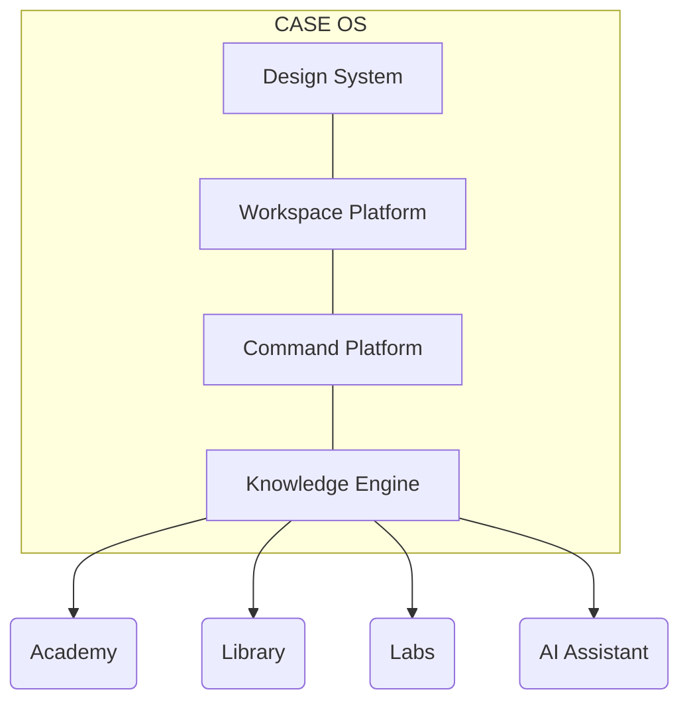

<div align="center">
  <h1>CASE OS</h1>
  <p><strong>The Engineering Operating System</strong></p>
  <p><em>Learn. Build. Experiment. Ship.</em></p>
  <br />
  <p>An engineering workspace inspired by VS Code, Linear and Raycast, designed for software engineers mastering AI, Java, Angular, AWS and modern engineering practices.</p>
  <br />
  
  [](https://angular.dev/)
  [](https://www.typescriptlang.org/)
  []()
  [](https://github.com/features/actions)
  []()
  [](LICENSE)
</div>

<br />

<div align="center">
  <!-- TODO: Reemplazar con captura limpia o GIF de la Command Palette -->
  
</div>

---

## ✨ Features

- **Engineering Workspace:** El hub central de operaciones.
- **Academy:** Currículum y módulos de aprendizaje integrados.
- **Library:** Recursos y documentación de ingeniería curados.
- **Labs:** Entornos experimentales para código y arquitectura.
- **Command Palette:** Búsqueda global y ejecución ultra rápida (`Ctrl+K`).
- **Keyboard First:** Diseñado para power users, totalmente accesible por atajos.
- **Design System:** Tokens de CSS puros, arquitectura escalable sin frameworks.
- **Declarative Architecture:** Plataforma basada en motores sin acoplamiento horizontal.
- **Angular Signals:** Reactividad moderna de última generación.
- **GitHub Pages Deployment:** Pipeline automatizado de despliegue continuo.

---

## ⚙️ Arquitectura

CASE OS no es una aplicación tradicional. Es un sistema operativo construido sobre 4 pilares fundamentales (Motores) totalmente desacoplados:

```text
CASE OS
├── Design Engine         (Design Tokens & Primitives)
├── Workspace Platform    (Declarative Manifests & Routing)
├── Command Platform      (Keyboard Shortcuts & Dispatching)
└── Knowledge Platform    (WIP - Search Providers & AI Context)
```

1. **Design Engine:** La única fuente de verdad visual. Consumo estricto de CSS Design Tokens (`var(--case-...)`).
2. **Workspace Platform:** Orquesta la aplicación leyendo un manifiesto declarativo (`WorkspaceRegistry`).
3. **Command Platform:** Un ecosistema centralizado (`Ctrl+K`) para descubrir y ejecutar comandos a través del Dispatcher.
4. **Knowledge Platform:** El futuro buscador unificado capaz de consultar múltiples proveedores (Academy, Labs, AI).

### Arquitectura Visual



---

## 🛠️ Stack Tecnológico

- **Framework:** Angular 22 (Standalone Components)
- **Reactivity:** Angular Signals (`signal`, `computed`, `effect`)
- **Language:** TypeScript 5.5+
- **Styling:** CSS Design Tokens & Primitives
- **Icons:** Material Symbols Outlined
- **CI/CD:** GitHub Actions & GitHub Pages

---

## 💻 Quick Start

### Requisitos
- Node.js v22.x+
- npm v10.x+

### Instalación
```bash
git clone https://github.com/YamiCueto/case-os.git
cd case-os
npm install
npm start
```
Abre tu navegador en `http://localhost:4200/`.

---

## 🚀 Build y Deployment

### Compilación Local
```bash
npm run build
```

### GitHub Pages (Automático)
El despliegue está orquestado mediante **GitHub Actions**. Cualquier push a `main` disparará el workflow (`.github/workflows/deploy.yml`), publicando la SPA optimizada en `yamicueto.github.io/case-os/`.

---

## 🛣️ Roadmap

### Phase I — Operating System
- [x] Design Engine
- [x] Workspace Platform
- [x] Command Platform
- [x] Engineering Workspace

### Phase II — Knowledge Platform
- [ ] Unified Search
- [ ] AI Assistant
- [ ] Context Engine

### Phase III — Collaborative Engineering
- [ ] Projects
- [ ] Agents
- [ ] Framework
- [ ] Multiplayer

---

## 📖 Documentación

El código fuente está respaldado por manifiestos arquitectónicos:

- [`CASE_OS_ARCHITECTURE.md`](CASE_OS_ARCHITECTURE.md) — Paradigma de Motores.
- [`CASE_UX_FOUNDATION.md`](CASE_UX_FOUNDATION.md) — Filosofía de Experiencia de Usuario.
- [`DESIGN.md`](DESIGN.md) — Documentación del Design System.

---

## 🤝 Contribución

CASE OS es estricto en su arquitectura. Antes de proponer un PR:
1. Asegúrate de que tu UI sea "Dumb" y dependa de un servicio inyectado.
2. Evita introducir CSS hardcodeado; utiliza únicamente `var(--case-*)`.
3. Todos los componentes de negocio deben registrarse vía Manifest.

---

## 📜 Licencia

Distribuido bajo la licencia [MIT](LICENSE). Construido con rigor para la ingeniería del futuro.
