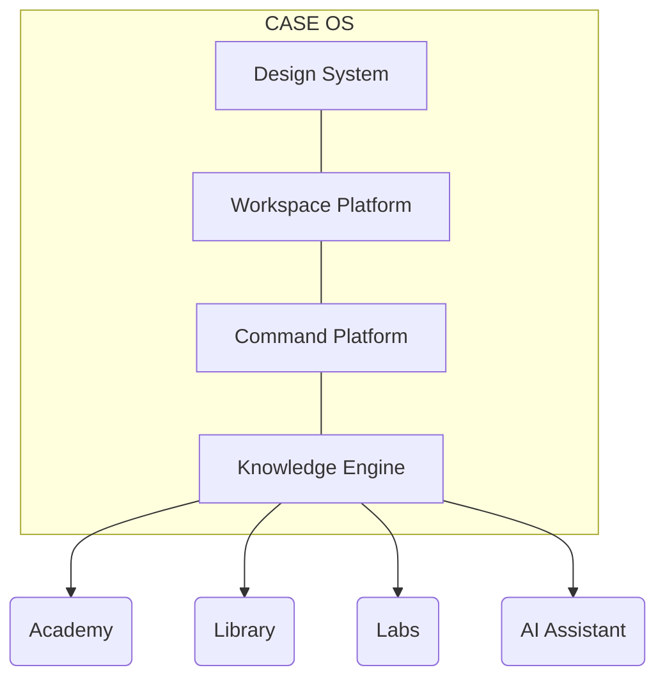

<div align="center">
  <!-- Reemplazar con una captura real del Engineering Workspace -->
  
  
  <br />
  
  <h1>CASE OS</h1>
  
  <p><strong>Engineering Operating System</strong></p>
  <p><em>The workspace where Software Engineers learn, build, experiment and collaborate.</em></p>
  
  <br />

  [](https://angular.dev/)
  [](https://www.typescriptlang.org/)
  []()
  [](https://github.com/features/actions)
  []()
  [](LICENSE)

</div>

---

## 🌌 Visión

**CASE ha evolucionado.** Lo que comenzó como un curso de IA Generativa es ahora **CASE OS**: un Operating System completo diseñado exclusivamente para ingeniería de software. No es un LMS (Learning Management System) tradicional, sino un **Engineering Workspace** inmersivo impulsado por arquitectura declarativa, motores de estado centralizados e interfaces orientadas al teclado que replican la experiencia de herramientas como VS Code, Linear y Raycast.

---

## ⚙️ Arquitectura de Motores (Engines)

El sistema operativo está construido sobre 4 pilares fundamentales totalmente desacoplados:

```text
CASE OS
├── Design Engine         (Design Tokens & Primitives)
├── Workspace Platform    (Declarative Manifests & Routing)
├── Command Platform      (Keyboard Shortcuts & Dispatching)
└── Knowledge Platform    (WIP - Search Providers & AI Context)
```

1. **Design Engine:** La única fuente de verdad visual. Consumo estricto de CSS Design Tokens (`var(--case-...)`). Cero colores hardcodeados o utilidades libres.
2. **Workspace Platform:** Orquesta la aplicación leyendo un manifiesto declarativo (`WorkspaceRegistry`). El Shell nunca conoce la lógica interna de un módulo.
3. **Command Platform:** Un ecosistema centralizado (`Ctrl+K`) para descubrir y ejecutar comandos, manejado por un Dispatcher puro.
4. **Knowledge Platform (WIP):** El futuro buscador unificado capaz de consultar múltiples proveedores (Academy, Labs, AI).

---

## 🏢 Workspaces

La plataforma se organiza en áreas de trabajo modulares:

* **Engineering Workspace (Dashboard)** — *El Hub central.*
* **Academy** — *Módulo de lecciones y currículum.*
* **Library** — *(Próximamente)*
* **Labs** — *(Próximamente)*
* **Projects** — *(Próximamente)*
* **Agents** — *(Próximamente)*
* **Framework** — *(Próximamente)*

---

## ⚖️ Principios de Ingeniería (Reglas de Oro)

1. **Declarative First:** Registries inmutables; los comandos y workspaces se configuran como datos, no como funciones imperativas.
2. **Dumb UI:** Los componentes visuales (ej. `CommandPalette`) no contienen lógica de negocio ni dependencias de otros módulos.
3. **Keyboard First:** Todas las acciones críticas son accesibles mediante `ShortcutService` y navegación por teclado (Autofocus, ARIA).
4. **Zero Horizontal Coupling:** Academy no conoce a Labs. Ambos se conectan únicamente al OS a través de manifiestos.
5. **Design Tokens Only:** Prohibida la inyección de estilos fuera del Design System.

---

## 🗺️ Arquitectura Visual



---

## 🛠️ Stack Tecnológico

- **Framework:** Angular 22 (Standalone Components)
- **Reactivity:** Angular Signals (`signal`, `computed`, `effect`)
- **Language:** TypeScript 5.5+
- **Styling:** CSS Design Tokens & Primitives
- **Icons:** Material Symbols Outlined
- **CI/CD:** GitHub Actions & GitHub Pages

---

## 💻 Desarrollo Local

### Requisitos
- Node.js v22.x o superior
- npm v10.x o superior

### Pasos de Instalación
```bash
# 1. Clonar el repositorio
git clone https://github.com/YamiCueto/case-os.git
cd case-os

# 2. Instalar dependencias
npm install

# 3. Iniciar el servidor de desarrollo
npm start
```
Abre tu navegador en `http://localhost:4200/`.

---

## 🚀 Build y Deployment

### Compilación Local
```bash
npm run build
```

### GitHub Pages (Automático)
El despliegue está orquestado mediante **GitHub Actions**. Cualquier push o merge a la rama `main` disparará el workflow (`.github/workflows/deploy.yml`), el cual inyectará el `base-href` correcto y publicará la SPA en `yamicueto.github.io/case-os/`.

---

## 📖 Documentación Principal

El código fuente está respaldado por manifiestos arquitectónicos:

- [`CASE_OS_ARCHITECTURE.md`](CASE_OS_ARCHITECTURE.md) — Paradigma de Motores.
- [`CASE_UX_FOUNDATION.md`](CASE_UX_FOUNDATION.md) — Filosofía de Experiencia de Usuario.
- [`DESIGN.md`](DESIGN.md) — Documentación del Design System.

*(Los documentos antiguos de la etapa "Curso" han sido archivados como Legacy en `/docs`).*

---

## 🛣️ Roadmap

### Phase 1 (Completada) 
- [x] Design Engine
- [x] Workspace Platform
- [x] Command Platform
- [x] Engineering Workspace
- [x] Project Renaissance

### Phase 2 (En Desarrollo) 
- [ ] Knowledge Platform
- [ ] Unified Search
- [ ] AI Platform
- [ ] Context Engine
- [ ] Projects / Agents / Framework

---

## 🤝 Contribución

CASE OS es estricto en su arquitectura. Antes de proponer un PR:
1. Lee las **Reglas de Oro** y la **Documentación Principal**.
2. Verifica que tu UI sea "tonta" (Dumb UI) y dependa de un servicio inyectado.
3. Asegúrate de no introducir CSS hardcodeado; utiliza únicamente las variables `var(--case-*)`.

---

## 📜 Licencia

Distribuido bajo la licencia [MIT](LICENSE). Construido con rigor para la ingeniería del futuro.
